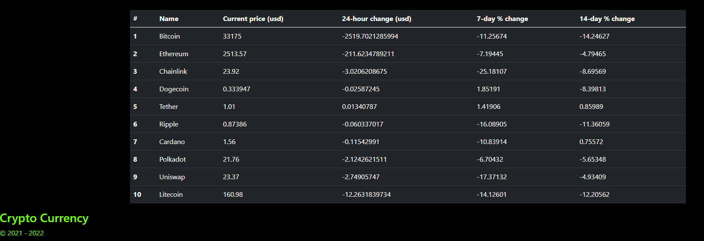

 # Cypto-Track-Star

 This project is covered by the ISC license

# Table of Contents
1. [Screenshots](#Screenshots) 
2. [Project Description](#description)
3. [Installation Process](#installation)
4. [Usage](#usage)
5. [Contributors](#contribution)
6. [License Coverage](#license)
7. [Questions](#questions)

## Screenshots:

## Description: 
This project was designed around using handlebars templating engine to render our data being requested  by our RESTful API to the front end of our app from the backend. We were able to make our application pull live data about cryptocurrency using an NPM Package called "Coingecko-api". Which then was rendered to the front-end of our application. You can use this application to track the 10 crpytocurrency's that we have listed.
## Installation: 
You will need the following NPM Packages to run this application: Express, Bcrypt, coingecko-api, connect-session-sequelize, dotenv, express-handlebars, experss-session,mysql, mysql2, and sequelize.
## Usage: 
You will invoke this application by running the command "Node server.js" in the CLI.
## Contribution: 
This project is currently not open for public contributions at this time
## Testing: 
We used insomnia to test our routes and we used console.log in front-end files to make sure we were pulling correct data with the coingecko-api NPM package.
## Questions: 
Any questions, comments, or concerns, please feel free to contact me at:
* Github: (https://github.com/Tfreed)

* Email: (tfreedwebdev94@gmail.com)
         (nparson88@gmail.com)
         (mknauss97@gmail.com)
         (mpmorvan@talbotdrake.com)

